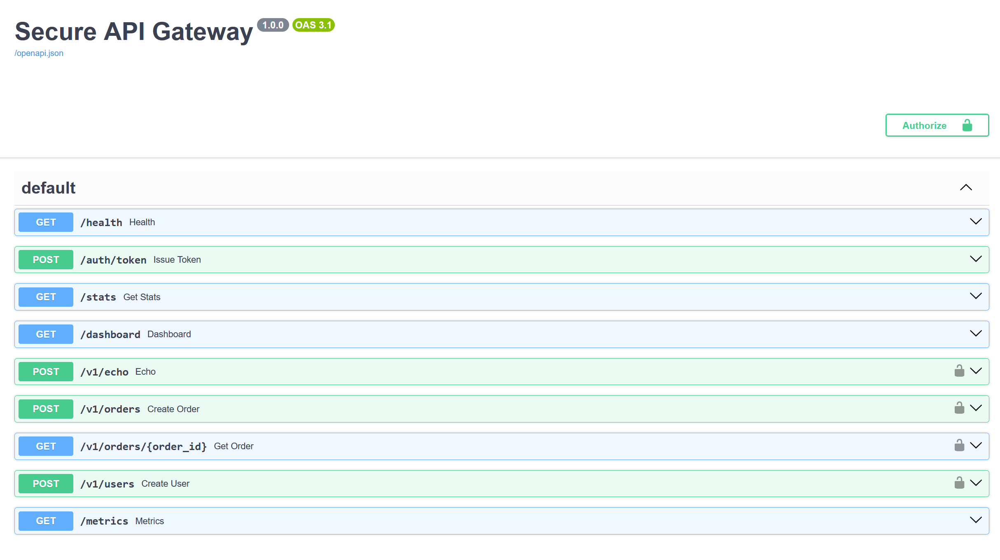
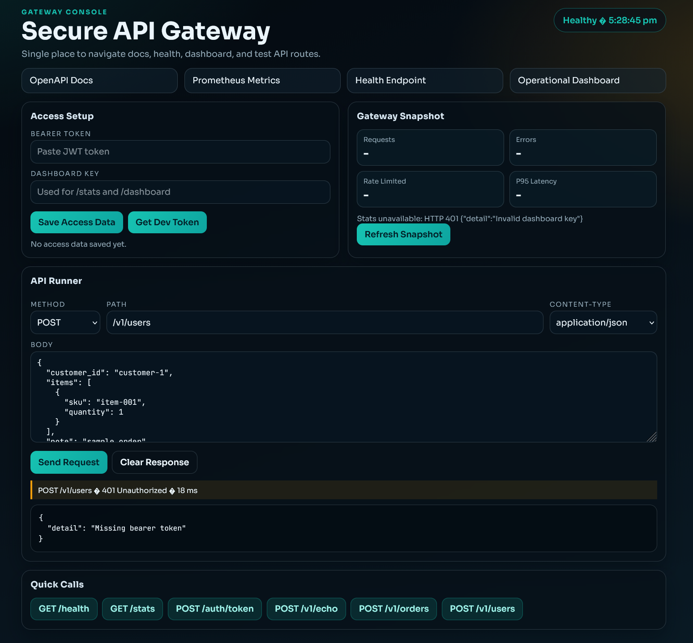

# Secure api Gateway (APIGATE)

Production-oriented API Gateway built with FastAPI, implementing authentication, request validation, rate limiting, structured audit logging, metrics exposure, and observability via OpenTelemetry.

This project is designed to demonstrate secure gateway architecture principles suitable for backend and security engineering roles.

## What It Does

- Verifies OAuth2 JWT tokens
- Validates requests against OpenAPI spec
- Applies rate limiting (Redis or local fallback)
- Emits audit logs (OTLP-ready)
- Exposes Prometheus metrics
- Provides basic operational dashboard
- Supports TLS

## Architecture (Simple Show)

Client → Gateway → Middleware Stack → Upstream Service

## How to run
Use this exact sequence from scratch in PowerShell.

### Setup
```bash
cd "F:\WORK\NOT YET\Secure_Api_Gateway"
Copy-Item .env.example .env -Force
```
Edit .env and set at least:
- OAUTH2_JWT_SECRET
- DASHBOARD_API_KEY
- Optional: set PORT=8000 to match Docker defaults

### Run with Docker (Docker and Docker compose required)
``` bash
docker compose down --remove-orphans
docker compose build --no-cache app
docker compose up -d
docker compose logs -f app
```
Open:
- Console UI: http://localhost:8000/
- Health: http://localhost:8000/health
- Docs: http://localhost:8000/docs

## Quick test

1) **Health**
```bash
Invoke-RestMethod -Method Get -Uri "http://localhost:8000/health"
```
2) **Get dev token (works when ENV != prod)**
```bash
$token = (Invoke-RestMethod -Method Post -Uri "http://localhost:8000/auth/token" -ContentType "application/json" -Body '{"username":"dev-user"}').access_token
```

3) **Call protected API**
```bash
Invoke-RestMethod -Method Post -Uri "http://localhost:8000/v1/echo" -Headers @{ Authorization = "Bearer $token" } -ContentType "application/json" -Body '{"hello":"world"}'
```
Dashboard:
- http://localhost:8000/dashboard?dashboard_key=<your DASHBOARD_API_KEY>

4) **Run tests**
```bash
python -m venv .venv
.\.venv\Scripts\Activate.ps1
pip install -r requirements-dev.txt
pytest -q
```

5) **Stop**
```bash
docker compose down
```

### Minimum required fields

    AUTH_REQUIRED=true
    OAUTH2_JWT_SECRET=devsecret
    REDIS_URL=redis://localhost:6379
    UPSTREAM_BASE_URL=http://localhost:9000

**Start Redis (Required for rate limiting)**
```bash
docker-compose up -d
```

**Run the Gateway**
```bash
uvicorn app.main:app --host 0.0.0.0 --port 8000
```

**Access:**

    http://localhost:8000
    
    
## Authentication

The gateway expects:
    Authorization: Bearer <YOUR_JWT_TOKEN>

For local development only:
    POST /auth/token

Example:

    curl -X POST http://localhost:8000/auth/token \
    -d "username=dev-user&password=dev"

Use returned token in protected routes.

## OpenAPI Validation

Defined in:
    specs/gateway.openapi.yaml

To disable validation:
    OPENAPI_VALIDATE_REQUESTS=false

## Rate Limiting

Default: Redis-backed fixed window.

Control with:

    RATE_LIMIT_REQUESTS=100
    RATE_LIMIT_WINDOW_SECONDS=60

Fallback:

    RATE_LIMIT_BACKEND=local

## Metrics & Dashboard

Metrics endpoint:

    GET /metrics

Dashboard:

    GET /dashboard

If protected:

    /dashboard?dashboard_key=YOUR_KEY


## Images

### Fasr API Dashboard


### Custom Interface


